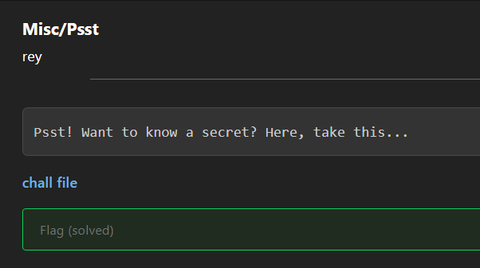
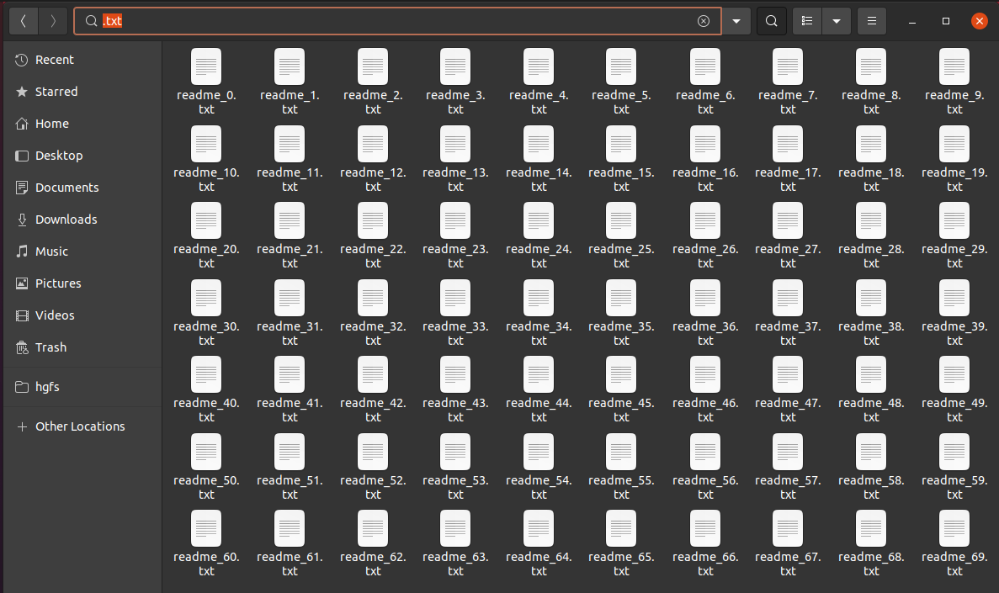
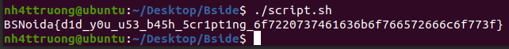
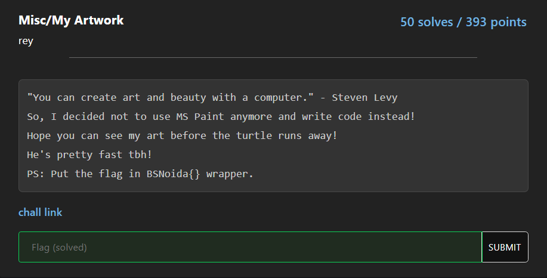
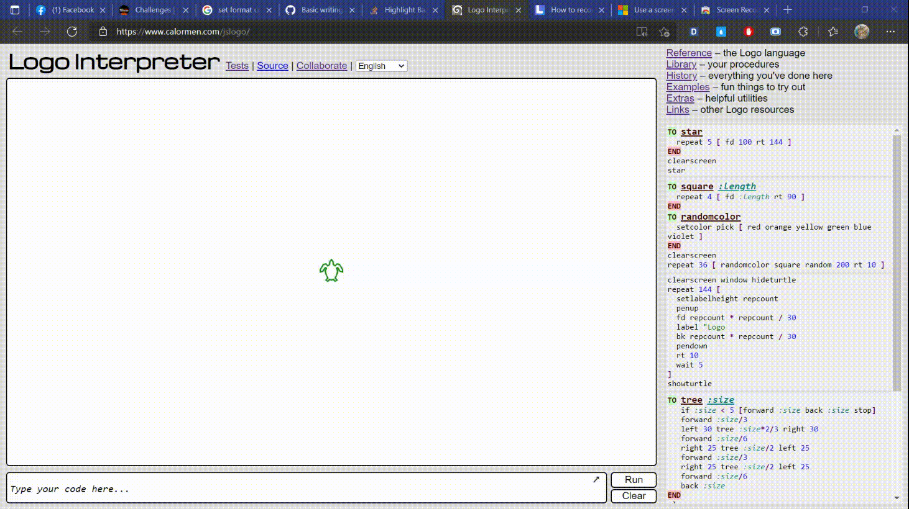

# WriteUp BSides Noida CTF
Website: [https://ctf.bsidesnoida.in/](https://ctf.bsidesnoida.in/)

# Misc/Psst

## Statement

This challenge:



After download, we have a [tar file](MissPsst/psst.tar.gz)

## Solution

After I had extracted it, I had a folder which contain some files in folder. I used search tool in Ubuntu to filter ".txt" and had this result:



The content in that files which joined is the flag. Therefore, I write a [small bashscript](MiscPsst/script.sh) below to make it easy:

```shell
#!/bin/bash

i="0"
res=""
while [ $i -lt 70 ]
do
path="readme_${i}.txt"
temp=$( cat $path )
res="$res$temp"
i=$[i + 1]
done
echo $res
```

And we got the flag!!!!

## Flag



# Misc/My Artwork

## Statement

This challenge:



Here is code -> [Code](myartwork/art.TURTLE)

## Solution

After searching for which type of code, I known that the code is Logo's turtle programming language. It will show graphic by graphic. So, I was try to compile it online by [Colormen](https://www.calormen.com/jslogo/) and got the flag.



## Flag

>**BSNoida{CODE_IS_BEAUTY_BEAUTY_IS_CODE}**
