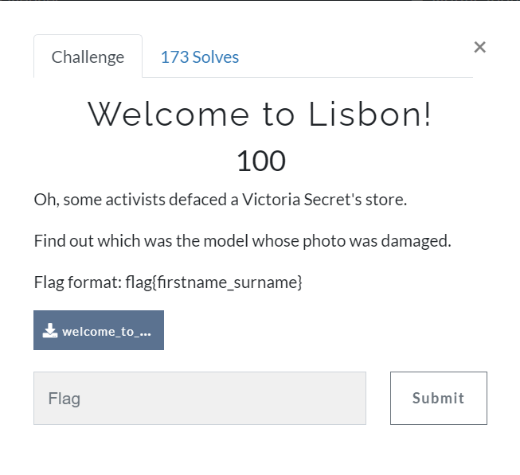
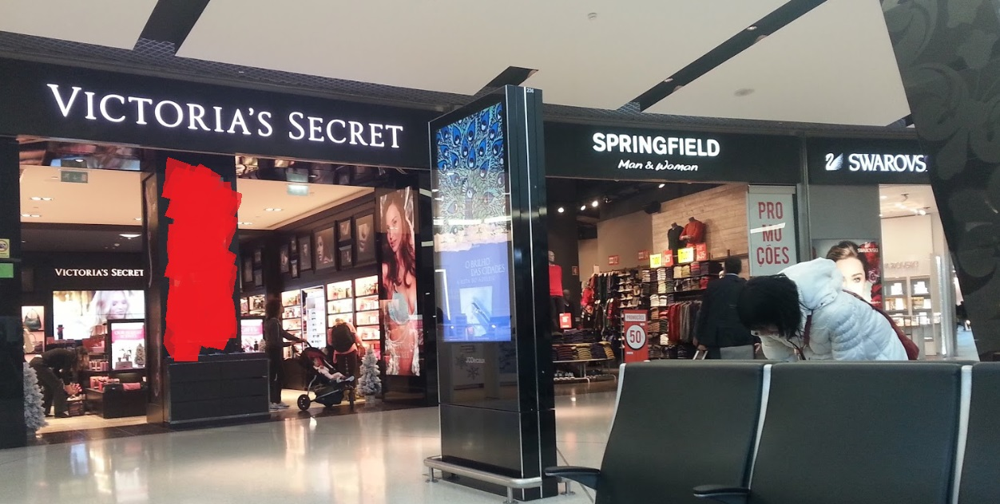
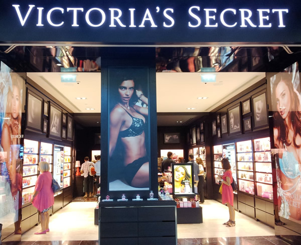
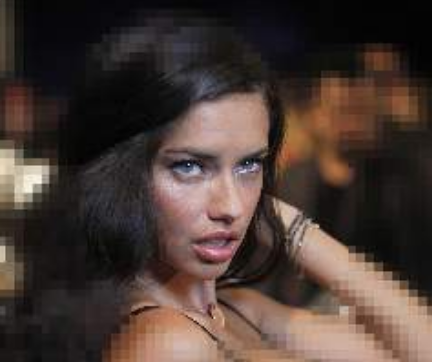

# RCTS CERT CTG 2021

Website:https://defendingthesoc.ctf.cert.rcts.pt/

## Welcome to Lisbon - OSINT

### Statement

The attached image behind:

### Solution

First, the challenge asked me to find out the model who is made up by the red brushes on the wall.

I was give a chance by use Google Image but it don't like what I expected. The challenge name is a hint which help me to locate where store is. I then use the keyword "Victoria Secret in Lisbon" and surf 7749 times in Google Image to find the store and the model graphic next to :>>. Finally, I have found out a image which look like up to 90% the attached image.

Yah, my work is how to know who is she. Trying to use some "find people" tools on the internet, I got this a quatily resolution image look like who I need to find.

Use this image and got that she is Adriana Lima in [this link](https://www.fanpop.com/clubs/adriana-lima/images/26769738/title/secret-fashion-show-2011-backstage-photo)

### Flag

>**flag(Adriana_Lima)**