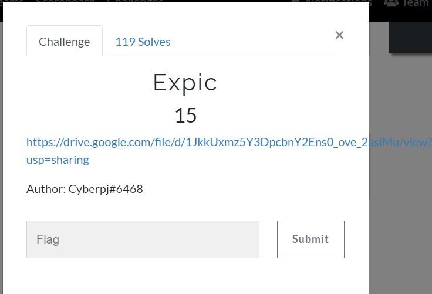
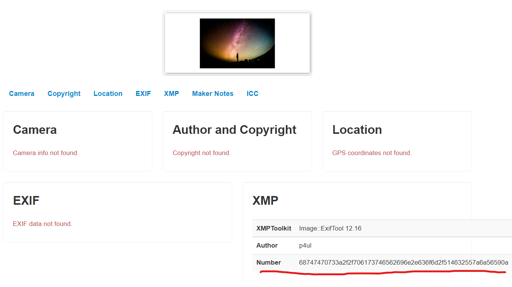
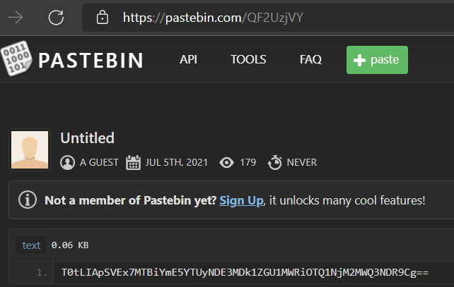
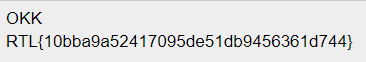
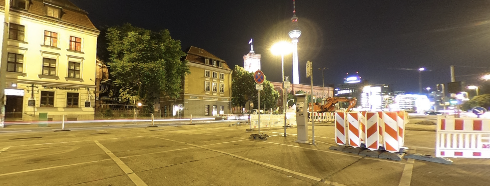
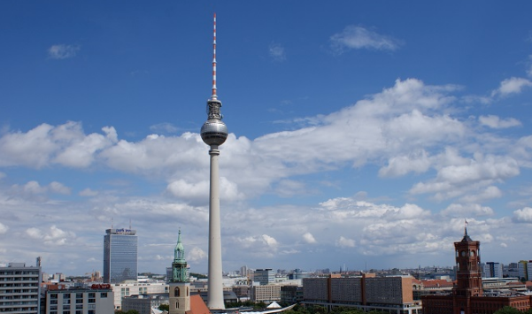
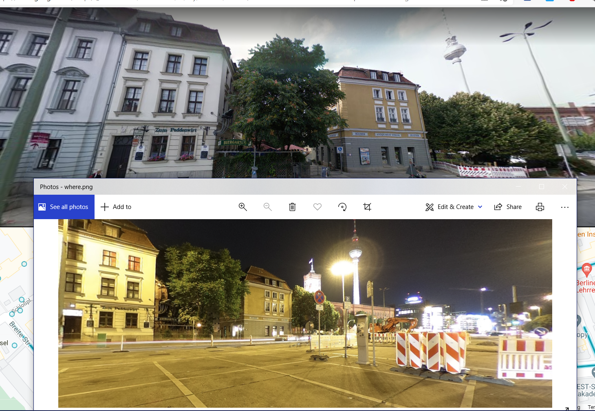

# WriteUp RTL-CTF

# Expic - Forensic

## Statement

## Solution
First, I think that the image will contain some data and I come up with "metadata". So I use [this tool](http://metapicz.com/#landing) to see what it be in.

It is the hex numbers. Next, I decrypt it to ASCII with [dcode.fr](https://www.dcode.fr/ascii-code) and have the link (https://pastebin.com/QF2UzjVY)[https://pastebin.com/QF2UzjVY]. In there, we have a code same as base64. Finally, decrypt this code and get the flag.

## Flag
>**RTL{10bba9a52417095de51db9456361d744}**

# Where is it? - OSINT

## Statement
We have this picture and our task is find out the location.

## Solution
The picture is so bad quality and I decided that use enhance tool to make it clarity.

Look at the picture, I was impressed by the tower behind. But we can't guess that what it name and where it is. After found something special on the picture, I see the text on the building wall. I guess that this text is * "Zum Puddelwerk" *. Use my google maps skill and I got a information relate to that name. That is the name of street in Germany. So that, I used two information about the given picture for the next step.

The next step, I use Google Image to search with "tower in Germany". After 10 minutes looked up on Google Images, I realized that is *"The Fernsehturm (TV Tower)"*:

All things are easy. I use Google Maps Street View to find out the location.

## Flag
>**RTL{52.516_13.408}**

