# Write-up | Down Under CTF 2021

[Down Under CTF 2021 Home page](https://downunderctf.com/)

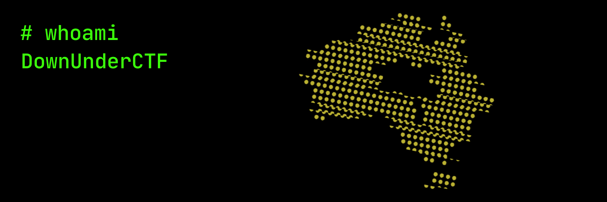

## Inside Out - Web

### Challenge

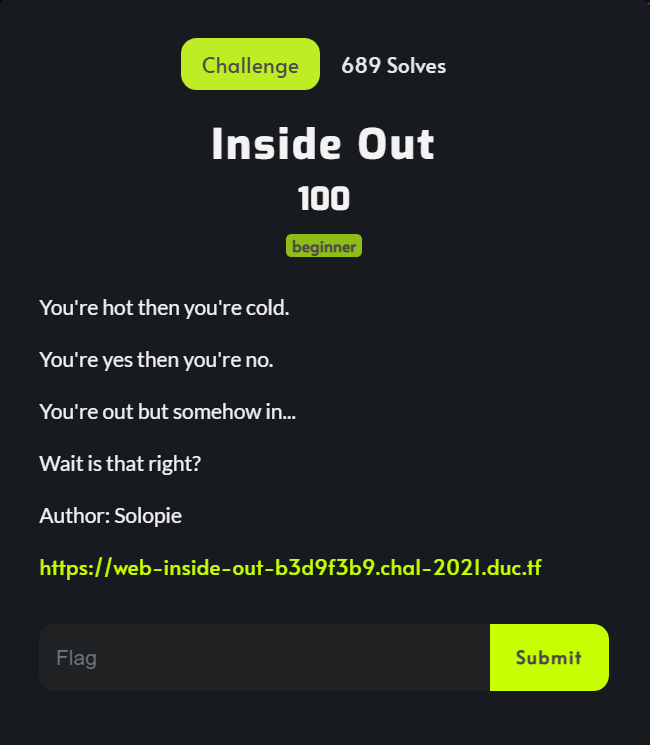

### Solution

Open the relate link *Proxy Example*, we have some infomations about the network configuration.

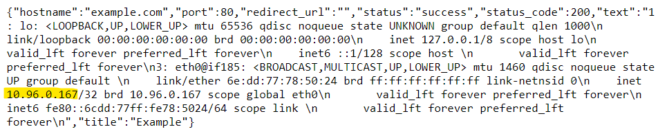

Look at the url bar on Chrome, I realize that it request *"/request?url=http://example.com/"*

With the ip address in *Proxy Example page*, I tried to request the site with payload: ```https://web-inside-out-b3d9f3b9.chal-2021.duc.tf/request?url=http://{ip_address}/admin``` and got the flag

### Flag


## Cowboy World - Web

### Challenge

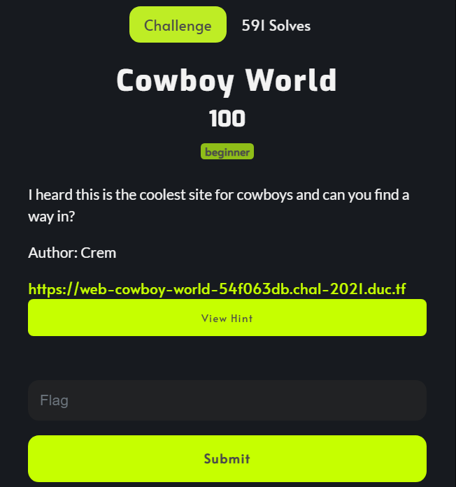

### Solution

Open the challenge link, we got the login site *cowboy* :((


Let's check the robots file and we have this:

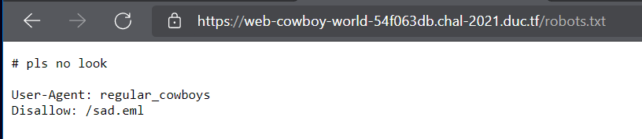

It's absolutely impossible to request to */sad.eml*. So, we need to try something like mod the HTTP Header. Change the User-Agent attribute to *"regular_cowboys"* and I succeed. The site was give me the *eml* file. Cat this file and capture the flag =)))

### Flag

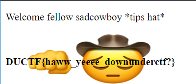

## nostrings - Re

### Challenge


### Solution

Use IDA tool and look a round. I thought that the author give everyone flag so that teams could happy before "capture" all flag of RE =)))
You can try with [the challenge source I put here](nostrings/nostrings)

### Flag

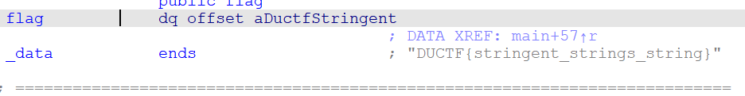

## Rabbit - Misc

### Challenge

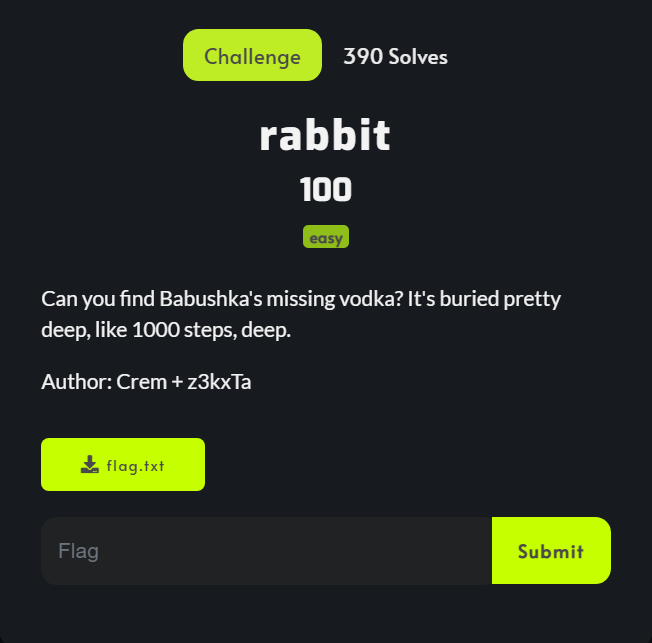

I [put the source here](rabbit/flag.txt) if you want to try after read this write-up

### Solution

My work is decompress 1000 times the *flag.txt*. So that, I was write a small bash script to capture the flag.

```bash
for i in {1..1000}
do
	eval "7z e flag* -y"
	eval "rm flag"
	find . -depth -name "fla*" -exec sh -c 'f="{}"; mv -- "$f" "flag"' \;
	echo $i
done
```

### Flag

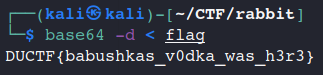

## General Skill - Misc

### Challenge

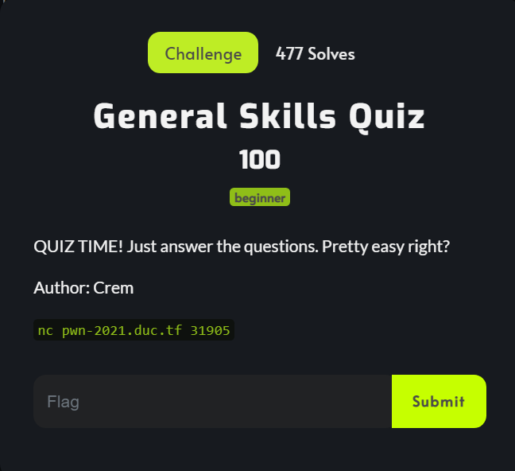

### Solution

We will answer all quiz (10s/question) to get the flag. But, I think it so difficult to "handmade" all quiz. So, I wrote this script to walk through challenge =)))
```python3
from pwn import *
import urllib
import base64
 
def rot13_decrypt(msg):
    plain = ""
    for i in msg:
        if (i == "_"):
            plain += "_"
            continue
        a = ord(i)
        shift = a - 13
        if (shift < 97):
            shift += 26
        plain += chr(shift)
    return plain

def rot13_encrypt(msg):
    cipher = ""
    for i in msg:
        if (i == "_"):
            cipher += "_"
            continue
        a = ord(i)
        shift = a + 13
        if (shift > 122):
            shift -= 26
        
        cipher += chr(shift)
    return cipher

def recv():
    return (io.recv().strip()).decode("utf-8")

io = remote("pwn-2021.duc.tf",31905)
#handle
io.recvuntil("Press enter when you are ready to start your 30 seconds timer for the quiz...")
io.sendline()
io.recvuntil("Answer this maths question: 1+1=?")
io.sendline(b"2")
io.recvuntil("Decode this hex string and provide me the original number (base 10): ")
io.sendline(str(int(recv(),16)).encode())
io.recvuntil("Decode this hex string and provide me the original ASCII letter: ")
io.sendline(str(chr(int(recv(),16))).encode())
io.recvuntil("Decode this URL encoded string and provide me the original ASCII symbols: ")
e = urllib.parse.unquote(recv())
io.sendline(str(e).encode())
io.recvuntil("Decode this base64 string and provide me the plaintext: ")
io.sendline(base64.b64decode(recv()).decode('utf-8'))
io.recvuntil("Encode this plaintext string and provide me the Base64: ")
io.sendline(base64.b64encode(recv().encode('utf-8')))
io.recvuntil("Decode this rot13 string and provide me the plaintext: ")
io.sendline(rot13_decrypt(recv()))
io.recvuntil("Encode this plaintext string and provide me the ROT13 equilavent: ")
io.sendline(rot13_decrypt(recv()))
io.recvuntil("Decode this binary string and provide me the original number (base 10): ")
a = recv()
a = a[2:]
io.sendline(str(int(a, 2)).encode())
io.recvuntil("Encode this number and provide me the binary equivalent: ")
h = recv()
h = bin(int(h))
io.sendline(str(h).encode())
io.recvuntil("Final Question, what is the best CTF competition in the universe?")
io.sendline(str("DUCTF").encode())

io.interactive()
```

### Flag

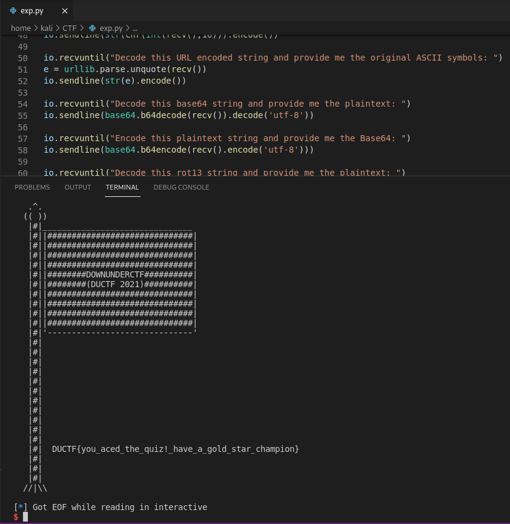

## Bad Bucket - Cloud

### Challenge

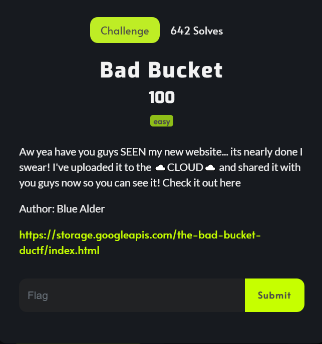

### Solution

It's so easy to find out the flag. Come back to the *"https://storage.googleapis.com/the-bad-bucket-ductf/"*, the site will be displayed the need informations

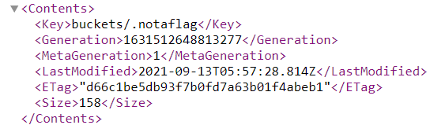

Request to *./notaflag*, I got the flag

### Flag

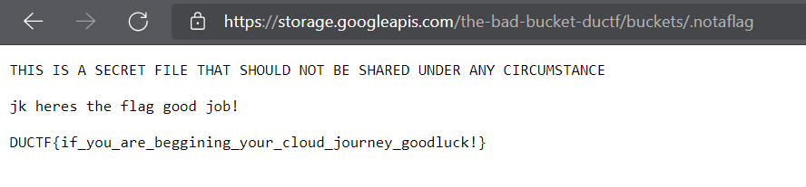

## Note

It's remain some challenge which I solved myself, but I think it so easy to write on here ^^
